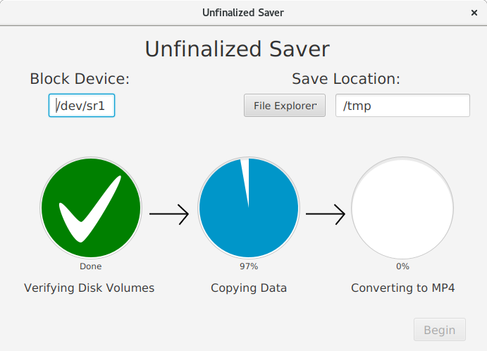
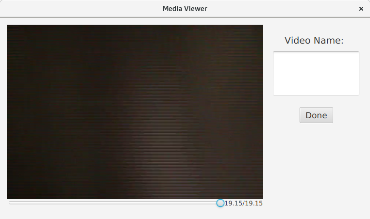

# Unfinalized Saver

Unfinalized Saver is a JavaFX 15 program to rip the VOB from an unfinalized DVD and convert it to MP4  
Only supports Linux due to the ease of working with block devices  
**This has only been tested with unfinalized DVDs recorded on a Panasonic VDR-M75PP**

## How It Works
The Panasonic VDR-M75PP format stores the entire VOB in track #4. Using `dvd+rw-mediainfo` to get the track size and start address, we can rip it with `dd` and convert it to MP4 (AAC audio) with `HandBrakeCLI`

The JavaFX application uses the script `executor.bsh` to run these commands, and provides status to the user. After the video conversion is complete, the user can watch/scrub through the video, and give it an approprite name.  

## Required Development Tools
* `IntelliJ 2020.3.1`
* `OpenJDK 15`

## Required Execution Tools
* `dd`
* `dvd+rw-tools`
* `HandBrake-cli`

## Build
Gradle project. Either open in IntelliJ, or execute the jlink task from the Gradle command line. 
```
./gradlew jlink
```

## Screenshots
Startup

<p align="center">
  
</p>

Media Viewer

<p align="center">
  
</p>